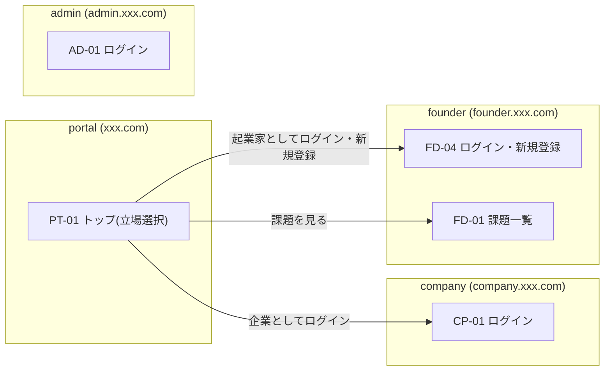
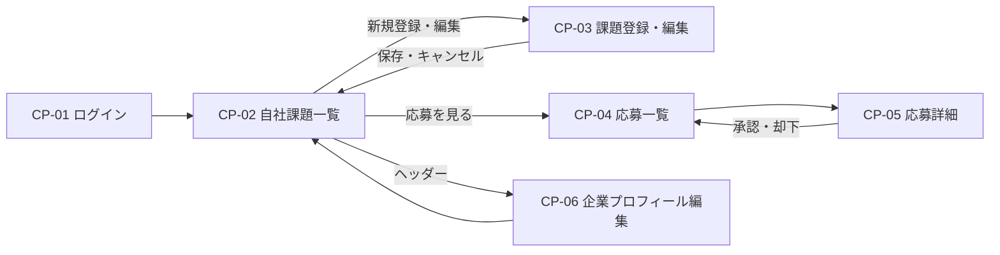
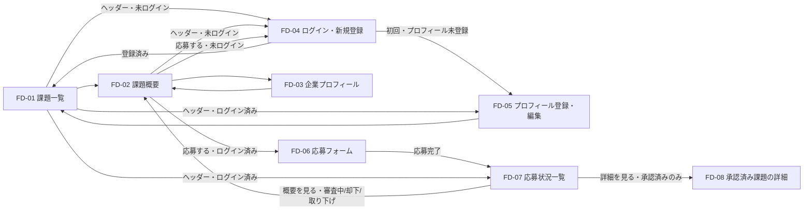
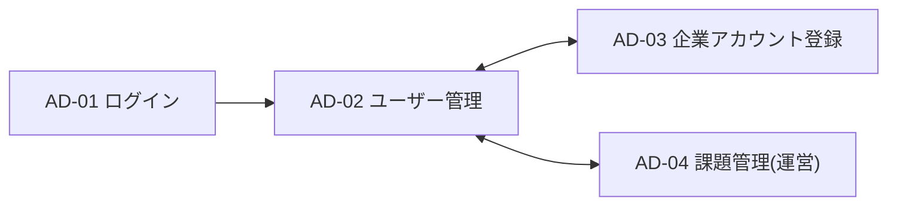

# NeedSeed 画面設計書

| 項目 | 内容 |
| --- | --- |
| 作成者 | 佐藤匠 |
| 作成日 | 2026/10/02 |
| ステータス | ドラフト |
| 関連文書 | [企画書](../planning.md) / [要件定義書](../requirements.md) |

## 1. アプリ構成と画面IDの付け方

利用者の立場ごとにアプリと認証を分けているため、画面IDはアプリごとのプレフィックスで管理する。

| プレフィックス | アプリ | 対象 | ドメイン | 認証 |
| --- | --- | --- | --- | --- |
| PT | portal | 全員 | xxx.com | なし |
| CP | company | 企業 | company.xxx.com | Clerk(企業用) |
| FD | founder | 起業家or起業を考えている人 | founder.xxx.com | Clerk(起業家用) |
| AD | admin | 運営者 | admin.xxx.com | Clerk(運営用) |

- アプリ間でログイン状態は共有しない。アプリ間の遷移は、URLによる移動（再ログインが必要）となる。
- ログイン後は、各アプリのホーム画面に遷移する。

## 2. 画面一覧

### 2.1 portal(PT)

| 画面ID | 画面名 | 利用者 | 概要 | 関連機能 |
| --- | --- | --- | --- | --- |
| PT-01 | トップ(立場選択) | 未ログイン | サービス紹介。「起業家or起業を考えている人としてログイン・新規登録」「企業としてログイン」を選択 | F-19 |

### 2.2 company(CP)

| 画面ID | 画面名 | 利用者 | 概要 | 関連機能 |
| --- | --- | --- | --- | --- |
| CP-01 | ログイン | 未ログイン | メールアドレス入力 → ワンタイムパスワード入力の2ステップ。新規登録の導線は置かない | F-02 |
| CP-02 | 自社課題一覧(ホーム) | 企業 | 自社の課題の一覧、公開/非公開の状態、応募数 | F-05 |
| CP-03 | 課題登録・編集 | 企業 | 課題の概要・詳細の入力、公開/非公開の設定、削除 | F-05 |
| CP-04 | 応募一覧 | 企業 | 課題ごとの応募の一覧と状態 | F-09 |
| CP-05 | 応募詳細 | 企業 | 起業家のプロフィールと提案文、承認・却下、承認後の連絡先表示 | F-09, F-11 |
| CP-06 | 企業プロフィール編集 | 企業 | 運営者が登録した初期情報の確認・編集 | F-03 |

### 2.3 founder(FD)

| 画面ID | 画面名 | 利用者 | 概要 | 関連機能 |
| --- | --- | --- | --- | --- |
| FD-01 | 課題一覧(ホーム) | 全員 | 公開中の課題の検索(キーワード・業種・地域)と一覧表示。未ログイン時はヘッダーにログイン導線 | F-06 |
| FD-02 | 課題概要 | 全員 | 課題概要と企業情報を表示。詳細は表示しない。応募への導線。未ログイン時はヘッダーにログイン導線 | F-07 |
| FD-03 | 企業プロフィール | 全員 | 企業の公開プロフィール | F-03 |
| FD-04 | ログイン・新規登録 | 未ログイン | メールアドレス入力 → ワンタイムパスワード入力。初めての場合はアカウントを作成 | F-01, F-02 |
| FD-05 | プロフィール登録・編集 | 起業家 | 初回ログイン時は登録、以降は編集 | F-04 |
| FD-06 | 応募フォーム | 起業家 | 提案文を入力して応募 | F-08 |
| FD-07 | 応募状況一覧 | 起業家 | 自分の応募の状態の確認、審査中の応募の取り下げ。承認済みは詳細画面へ | F-10 |
| FD-08 | 承認済み課題の詳細 | 起業家(承認済みのみ) | 課題詳細と企業の連絡先を表示 | F-07, F-11 |

### 2.4 admin(AD)

| 画面ID | 画面名 | 利用者 | 概要 | 関連機能 |
| --- | --- | --- | --- | --- |
| AD-01 | ログイン | 未ログイン | メールアドレス入力 → ワンタイムパスワード入力 | F-02 |
| AD-02 | ユーザー管理(ホーム) | 運営者 | 企業・起業家の一覧(タブ切り替え)、利用停止・再開 | F-12 |
| AD-03 | 企業アカウント登録 | 運営者 | 企業のアカウントと初期データ(プロフィール)の登録 | F-14, F-03 |
| AD-04 | 課題管理(運営) | 運営者 | 全課題の一覧、不適切な課題の非公開化 | F-13 |

## 3. 画面遷移図

### 3.1 アプリ間の遷移



※ 運営者向けの導線はポータルに置かない（URLを直接開く）。

### 3.2 company



### 3.3 founder



※ FD-01・FD-02のヘッダーには、未ログイン時は「ログイン・新規登録」を表示し、FD-04へ遷移できる。ログイン済みの場合は「応募状況」「プロフィール」を表示する。
※ ヘッダーからログインした場合は、ログイン後に元のページ（FD-01またはFD-02）へ戻す。「応募する」からログインした場合も、元のFD-02へ戻す。初回でプロフィール未登録の場合はFD-05を経由してから戻す。
※ FD-02は承認の有無にかかわらず概要のみを表示する。ログイン済みでも詳細は表示しない。
※ FD-08へは、FD-07で状態が「承認」の応募からのみ遷移できる。URLを直接開いた場合も、サーバー側で承認済みかを確認し、未承認なら表示しない。
※ プロフィール未登録の状態では、FD-05以外のログイン後の操作（応募など）に進めず、FD-05へ誘導する。

### 3.4 admin



## 4. 主要画面の項目

### FD-02 課題概要

| 項目 | 未ログイン | ログイン済み・未応募 | 審査中 | 承認済み | 却下・取り下げ |
| --- | --- | --- | --- | --- | --- |
| タイトル | ○ | ○ | ○ | ○ | ○ |
| 課題概要 | ○ | ○ | ○ | ○ | ○ |
| 業種・地域 | ○ | ○ | ○ | ○ | ○ |
| 企業名・プロフィールへのリンク | ○ | ○ | ○ | ○ | ○ |
| 課題詳細 | × | × | × | ×(FD-08で表示) | × |
| 企業の連絡先 | × | × | × | ×(FD-08で表示) | × |
| ボタン | ログインして応募 | 応募する | 応募状況を見る | 詳細を見る(FD-08へ) | - |

### FD-08 承認済み課題の詳細

| 項目 | 表示条件 | 備考 |
| --- | --- | --- |
| タイトル | 承認済みのみ | |
| 課題概要 | 承認済みのみ | |
| 課題詳細 | 承認済みのみ | 社外秘に近い情報 |
| 企業の連絡先 | 承認済みのみ | 担当者名・メール |
| 応募の状態 | 常に | 承認 |

※ 課題が後から非公開になった場合も、承認済みの起業家には引き続き表示する。

### CP-03 課題登録・編集

| 項目 | 種類 | 必須 | 備考 |
| --- | --- | --- | --- |
| タイトル | テキスト | ○ | <!-- TODO: 文字数上限 --> |
| 課題概要 | テキストエリア | ○ | 全体に公開される |
| 課題詳細 | テキストエリア | ○ | 承認した相手にのみ公開される |
| 業種 | 選択 | ○ | 分類はデータ設計で決定 |
| 地域 | 選択 | ○ | 分類はデータ設計で決定 |
| 公開状態 | 切り替え | ○ | 公開 / 非公開 |

### CP-05 応募詳細

| 項目 | 表示条件 | 備考 |
| --- | --- | --- |
| 応募先の課題 | 常に | タイトルを表示 |
| 起業家のプロフィール | 常に | 経歴・スキル・関心分野。自社の課題に応募した人のみ閲覧可 |
| 提案文 | 常に | |
| 応募の状態 | 常に | 審査中 / 承認 / 却下 / 取り下げ |
| 承認・却下ボタン | 審査中のみ | |
| 起業家の連絡先 | 承認後のみ | |

### FD-06 応募フォーム

| 項目 | 種類 | 必須 | 備考 |
| --- | --- | --- | --- |
| 応募先の課題 | 表示のみ | - | タイトルと概要を表示 |
| 提案文 | テキストエリア | ○ | <!-- TODO: 文字数上限 --> |

### AD-03 企業アカウント登録

| 項目 | 種類 | 必須 | 備考 |
| --- | --- | --- | --- |
| ログイン用メールアドレス | メール | ○ | 企業がログインに使う |
| 企業名 | テキスト | ○ | |
| 業種 | 選択 | ○ | |
| 地域 | 選択 | ○ | |
| 規模(従業員数) | 選択 | ○ | |
| 連絡先(担当者名・メール) | テキスト | ○ | 承認後に起業家へ開示される |

※ プロフィール項目の詳細はER図で確定する。

## 5. ワイヤーフレーム

### PT-01 トップ(立場選択)

```
+------------------------------------------------+
| NeedSeed                                        |
+------------------------------------------------+
| 企業の課題から、新しい事業が始まる               |
|                                                 |
| +--------------------+ +---------------------+ |
| | 企業の方           | | 起業家・起業を       | |
| |                    | | 考えている方         | |
| | 課題を登録して     | | 実在する課題から     | |
| | 解決する人を探す   | | 事業を始める         | |
| |                    | |                     | |
| | [企業としてログイン]| | [ログイン・新規登録] | |
| +--------------------+ +---------------------+ |
|                                                 |
|            公開中の課題を見る >                  |
+------------------------------------------------+
```

### FD-02 課題概要

```
+------------------------------------------------+
| NeedSeed        [ログイン・新規登録]            |
|  (ログイン済みの場合: 課題一覧 応募状況 プロフィール) |
+------------------------------------------------+
| 【課題タイトル】                                 |
| 業種：製造業   地域：北海道                      |
| 株式会社〇〇 >                                   |
|------------------------------------------------|
| ■ 課題概要                                      |
| ...                                             |
|------------------------------------------------|
|              [ログインして応募]                  |
|  (ログイン済み: [応募する] など状態に応じて切替)  |
+------------------------------------------------+
```

### FD-08 承認済み課題の詳細

```
+------------------------------------------------+
| NeedSeed      課題一覧  応募状況  プロフィール   |
+------------------------------------------------+
| 【課題タイトル】                                 |
| 業種：製造業   地域：北海道                      |
| 株式会社〇〇 >                                   |
|------------------------------------------------|
| ■ 課題概要                                      |
| ...                                             |
|------------------------------------------------|
| ■ 課題詳細(承認済みのため表示)                  |
| ...                                             |
|------------------------------------------------|
| ■ 企業の連絡先                                  |
| 担当者：〇〇  メール：xxx@example.com            |
+------------------------------------------------+
```

<!-- TODO: 他の主要画面(FD-01, CP-02, CP-05, AD-02 など)のワイヤーフレーム -->

## 6. 機能と画面の対応(MVP)

| 機能 | 対応画面 |
| --- | --- |
| F-01 アカウント登録 | FD-04 |
| F-02 ログイン・ログアウト | CP-01, FD-04, AD-01(ログアウトは各アプリのヘッダー) |
| F-03 企業プロフィール管理 | AD-03(初期登録), CP-06(編集), FD-03(閲覧) |
| F-04 起業家プロフィール管理 | FD-05 |
| F-05 課題管理 | CP-02, CP-03 |
| F-06 課題検索 | FD-01 |
| F-07 課題閲覧 | FD-02(概要), FD-08(詳細) |
| F-08 応募 | FD-06 |
| F-09 応募管理(企業) | CP-04, CP-05 |
| F-10 応募管理(起業家) | FD-07 |
| F-11 連絡先の開示 | FD-08(企業の連絡先), CP-05(起業家の連絡先) |
| F-12 ユーザー管理(運営) | AD-02 |
| F-13 課題管理(運営) | AD-04 |
| F-14 企業アカウント登録(運営) | AD-03 |
| F-19 ポータル(立場選択) | PT-01 |

## 7. 検討事項

| 項目 | 内容 | 方針(案) |
| --- | --- | --- |
| 公開課題一覧の置き場所 | 未ログインで見られる課題一覧をどのアプリに置くか | founderアプリの公開ページ(FD-01, 02)に置く。要件定義書の未決事項と同じ |
| 企業による他社課題の閲覧 | 要件定義書5.2は企業の「課題概要の閲覧」を○としているが、companyアプリには他社の課題を見る画面がない | companyアプリでは自社の課題のみとし、5.2に注記を足す。他社の課題を見せたい場合は画面を追加する |
| 応募がある課題の削除 | 応募済みの起業家がいる課題を削除してよいか | 応募がある課題は削除不可とし、非公開化のみ可能にする |
| 承認済みの課題が非公開になった場合 | 承認済みの起業家が課題詳細・連絡先を見られるか | 承認済みの起業家には、FD-08で引き続き表示する |
| 却下・取り下げ後の再応募 | 同じ課題への再応募を認めるか | 不可(F-08の重複応募不可に含める) |
| 利用停止中のユーザー | 停止された企業・起業家の扱い | ログイン不可。企業は課題を自動で非公開にする。停止状態はDBで管理し、全リクエストで確認する |
| 企業アカウントの登録方法 | AD-03でClerkのアカウントまで作成するか、Clerkダッシュボードで作成してAD-03はDBの初期データ登録のみとするか | MVPはダッシュボードで作成し、AD-03はDB登録とClerkユーザーIDの紐づけのみ |
| ログイン後の戻り先の引き継ぎ | ヘッダー・応募ボタンからログインした後、元のページへ戻す方法 | URLパラメータ(リダイレクト先)で引き継ぐ。外部URLへ飛ばされないよう、同一アプリ内のパスのみ許可する |

## 更新履歴

| 日付 | 内容 |
| --- | --- |
| 2026/10/02 | 初版作成。承認済み課題の詳細画面(FD-08)の追加、ヘッダーからのログイン導線を反映 |